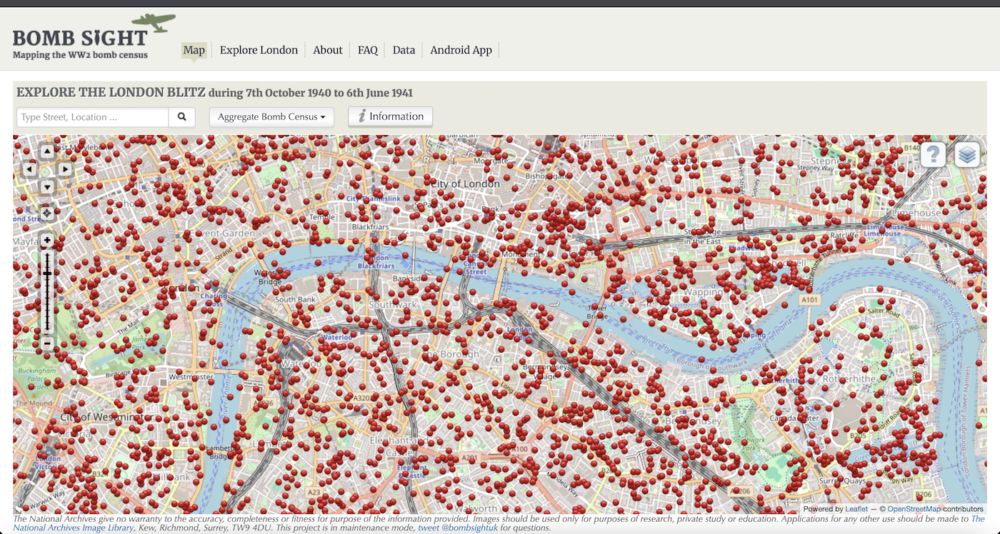

# Bomb Sight - Mapping the World War 2 London Blitz Bomb Census

Static archive of the Bomb Sight project.



## About the project

The Bomb Sight project is mapping the London WW2 bomb census between 7/10/1940 and 06/06/1941. 

Previously available only by viewing in the Reading Room at The National Archives, Bomb Sight is making the maps available to citizen researchers, academics and students. 

They will be able to explore where the bombs fell and to discover memories and photographs from the period.

## Website access

NOTE: the website is gradually being rebuilt as a static snapshot, and not all functionality is available yet.

| Label                         | URL                                                       |
|-------------------------------|-----------------------------------------------------------|
| Original                      | https://bombsight.org                                     |
| Temporary (S3 http)           | http://bombsight-web.s3-website-eu-west-1.amazonaws.com   |
| Temporary (S3 via CloudFront) | https://d3i7uuksfqccvr.cloudfront.net                     |

### Remaining issues

* Website
  * Missing all /bombs/* detail pages ([sample](http://bombsight-web.s3-website-eu-west-1.amazonaws.com/bombs/10016/))
* Mapping and data
  * Geoserver needs restarting/replacing (possibly with static)
  * Bombs datasets missing address reverse geocoding
  * Raster layers need to be recovered
  * Defence sites layer needs to be recovered
* Background mapping provider
  * Base map provider should be replaced with new provider (currently OpenStreetMap, previously Carto)
  * Nominatim geocoder should be replaced with new provider (currently OpenStreetMap, previously Mapquest)
  * Aerial imagery layer to be re-added if available (previously Bing)
* Third party services
  * AddThis needs removing/updating
  * Google Analytics may need updating
  * Google Ads needs updating
  
## Data snapshot

| Dataset                                                | Layer Name                             | Type   | File                                                                                                                       |
|--------------------------------------------------------|----------------------------------------|--------|----------------------------------------------------------------------------------------------------------------------------|
| First Night of the Blitz (7 Sep 1940)                  | day_bomb                               | Point  | [CSV](data/csv/day-bomb.csv)<br>[GeoJSON](data/geojson/day-bomb.geojson)<br>[GeoPackage](data/geopackage/day-bomb.gpkg)    |
| Aggregate Bomb Census points (7 Oct 1940 - 6 Jun 1941) | agg_bomb                               | Point  | [CSV](data/csv/agg-bomb.csv)<br>[GeoJSON](data/geojson/agg-bomb.geojson)<br>[GeoPackage](data/geopackage/agg-bomb.gpkg)    |
| Aggregate Bomb Census map (7 Oct 1940 - 6 Jun 1941)    | agg_mosaic_auto_contrast_sharpen_15    | Raster | TBC                                                                                                                        |
| Weekly Bomb Census points (7-14 Oct 1940)              | week_bomb                              | Point  | [CSV](data/csv/week-bomb.csv)<br>[GeoJSON](data/geojson/week-bomb.geojson)<br>[GeoPackage](data/geopackage/week-bomb.gpkg) |
| Weekly Bomb Census map (7-14 Oct 1940)                 | weekly_mosaic_auto_contrast_sharpen_15 | Raster | TBC                                                                                                                        |
| Defence Sites                                          | defence_site                           | Point  | TBC                                                                                                                        |

## Terms of use

All material on this website and the mobile App is made available free of charge for non-commercial individual, academic and research use only.

All material on this website and the mobile App is not  intended for any commercial or legal activities.

Commercial exploitation of the maps, datasets, and background material provided on this website, whether in their original form or in maps of data created on this site, is prohibited.

* For the original Bomb Census Maps both weekly and aggregate, permission is required from The National Archives, London, England.
* For the 24 hours of the 7th September permission is required from the Guardian
* For the Imperial War Museum images – permission is required from the Imperial War Museum
* For the BBC history WW2 memories, permission is required as appropriate from the original contributor of the story.
* For the bomb site locations dataset permission is required from the project via the University of Portsmouth
* For the Defence of Britain dataset, permission is required from the Council of British Archaeology.

## Disclaimer

The Bomb Sight Project gives no warranty to the accuracy, completeness or fitness for purpose of the information provided. Commercial exploitation of the images, maps, datasets, and background material provided on this website is prohibited. Material should be used only for purposes of non-commercial research, private study or education.
The Bomb Sight project was funded as part of JISC's Content Programme 2011-13

## External resources
* [The National Archives](https://www.nationalarchives.gov.uk/)
  * [Bomb Census survey 1940-1945 - research guide](https://www.nationalarchives.gov.uk/help-with-your-research/research-guides/bomb-census-survey-records-1940-1945/)
  * [London Bomb Census Maps - scanned maps](https://images.nationalarchives.gov.uk/search/?searchQuery=London+bomb+census)

## Dev notes

### Archival using wget

`wget` can be used to retrieve all the pages from the original site and rewrite the URLs for local use, though it will still require a little manual fixing.

```
wget -rH -Dbombsight.org,static.prod.bombsight.org,static.prod.bombsight.org -l 5 -p --convert-links -i seed-urls.txt
```

### Geoserver

To pull:
```
docker pull docker.osgeo.org/geoserver:2.28.0
```

To run:
```
docker run  -it -p 8080:8080 \
  --mount type=bind,src=<path>/geoserver/data,target=/opt/geoserver_data \
  --env SKIP_DEMO_DATA=true \
  --env ENABLE_JSONP=true \
  docker.osgeo.org/geoserver:2.28.0
```

To login: http://127.0.0.1:8080/geoserver/web (admin/geoserver)

TODO:
  * Dockerfile
  * security
    * set admin login
    * ensure details are left out of repo
  * styling
  * deployment